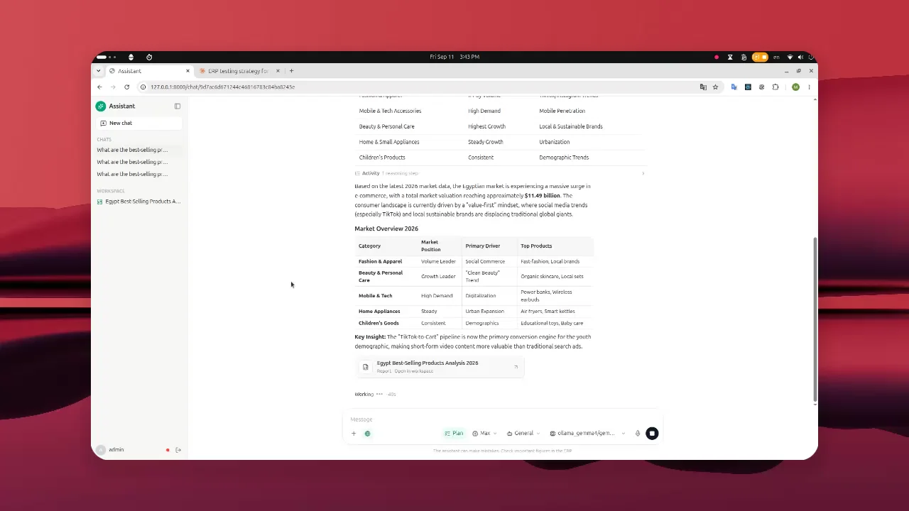
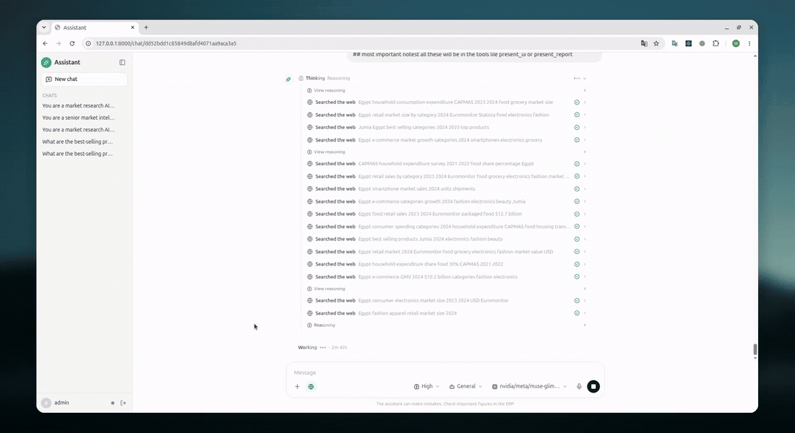

# Django Deep Agent

This is my full-stack conversational agent built with Django, React,
LangGraph, and Deep Agents. My main focus is the agent implementation and the
Django backend that runs it safely for multiple authenticated users.

## Demo

### Chat and generative UI

[](media/chat-generative-ui.mp4)

### Research report workspace



## Agent implementation

- `deep_agent_app/agent/prompts.py` contains the main and subagent instructions.
- `deep_agent_app/agent/subagent.py` defines delegated agents.
- `agent_skills/` contains reusable skills loaded with progressive disclosure.
- `deep_agent_app/agent/tools/` contains search, reports, UI, and human-input tools.
- `deep_agent_app/agent/integrations/` manages persistent MCP connections.

`present_ui` and `present_report` render typed tables, KPIs, charts, status
blocks, and reports. `ask_user` pauses LangGraph to collect several answers.

Filesystem permissions protect skill files from agent writes, while tool
approval interrupts can stop sensitive actions for human confirmation.

## Architecture

```text
React UI
   ↓ HTTP + SSE
Django views.py
   ↓ validation, authentication, thread ownership
chat/chat.py
   ↓ stream orchestration
agent/agent.py
   ↓ prompts, models, subagents, skills, tools and MCP
LangGraph
```

## Quick start

Requirements:

- Python 3.12+

```bash
python -m venv .venv
source .venv/bin/activate
pip install -r requirements.txt

cp deep_agent_app/config/secrets.example.json \
   deep_agent_app/config/secrets.json
```

Edit the private secrets file and replace at least the selected provider API
key. Remove provider entries you do not intend to offer.

Create the database, then create the username and password used to sign in:

```bash
python manage.py migrate
python manage.py createsuperuser
python manage.py runserver
```

Open http://127.0.0.1:8000/chat/.

The custom `runserver` command launches Uvicorn because the shared async
runtime requires ASGI. The compiled React frontend is included in the
repository, so Node.js is not required to run the application.

## Configuration

Models and optional MCP integrations are configured in the private
`deep_agent_app/config/secrets.json` file. It is ignored by Git; only the
example file is committed.

`deep_agent.flash_model`, `deep_agent.main_model`, and
`deep_agent.frontier_model` name IDs in `llm.providers`. These are stable roles,
not model names or credentials. The example maps all three to the existing
`ollama` provider for now; change each mapping in your private file when
you are ready to use separate models. `Auto` resolves to Main, while a
user can explicitly select Flash, Main, or Frontier. There is no unmeasured
automatic escalation to Frontier. The Flash role also performs internal
compaction summaries when compaction is enabled. Existing direct provider IDs
remain selectable for compatibility. An older private file containing only
`deep_agent.llm_provider` still starts with all three roles pointing at that
provider; configure all three new keys together when migrating. Partial or
unknown role mappings fail at startup.

For models that reject a sampling-temperature parameter, set
`send_temperature: false` on that provider. The example leaves
`max_input_tokens` unset: fill in verified input limits for **every**
selectable provider before enabling context compaction. The example API keys
are placeholders, not usable credentials.

Skills live under `agent_skills/general/`. Slash commands and mentions are
configured in `deep_agent_app/config/commands.json` and `mentions.json`.
Production environment variables are documented in [`.env.example`](.env.example).

When changing the React frontend, use Node.js 22+ and rebuild the committed
static files:

```bash
npm --prefix frontend ci
npm --prefix frontend run build
```

## Tests

On Python 3.12, use `requirements-dev.lock` for the tested, fully resolved
development dependency set; `requirements.lock` contains the production set.
The source `requirements*.txt` files retain the direct dependency choices.

```bash
python manage.py check
python manage.py test
```

GitHub Actions also checks Python formatting, migrations, TypeScript, and the
frontend production build.

## Production and scaling

Before deploying on Ubuntu, configure and verify the command sandbox using
[the Bubblewrap deployment guide](docs/ubuntu-bubblewrap-sandbox.md).

```bash
DJANGO_SETTINGS_MODULE=config.settings.production \
python -m uvicorn config.asgi:application --host 0.0.0.0 --port 8000 --workers 1
```

The included SQLite checkpointer and process-local thread reservations use one
ASGI worker. PostgreSQL checkpoints and shared leases are required before
running multiple workers.

The current MCP client is process-shared and accepts only service-scoped
credentials. A shared token does not represent the signed-in user. Connected
services must enforce the intended company/workspace access boundary, and a
per-user credential must not be placed in this configuration. Per-user MCP
bindings need a separate runtime design before they can be enabled.

`fetch_webpage_content` rejects non-public URL destinations and bounds redirects,
response types, size, and runtime. DNS can change between validation and the
HTTP connection, so production network policy must also deny outbound access to
private, loopback, link-local, and metadata-service addresses. Do not treat the
application-level URL check as a complete SSRF boundary.

The runtime applies shared per-turn limits for model attempts (including provider
retries and delegated work), tool calls, elapsed time, and concurrent runs.
`runtime.max_model_calls_per_turn` and `runtime.max_tool_calls_per_turn` default
to 64 and 128. A limit stops the turn with a visible error; it does not claim
partial work succeeded. A provider completion with no answer or tool call is
retried once and then reported as an error rather than silently ending.
Three invalid `present_report` or `present_ui` attempts in one turn stop that
turn with a visible error, preventing a schema-repair loop from consuming the
larger general tool budget. This does not validate the factual content of a
successfully rendered report.

Conversation compaction is opt-in under `runtime.context_compaction`. Before
enabling it, record a **verified** `max_input_tokens` for every selectable
provider. The configured `trigger_tokens + reserve_tokens` must fit the
smallest of those windows; this is checked at startup. The Flash-role provider
performs summaries. Compaction keeps the raw checkpoint messages,
offloads older history into checkpoint-backed files, and presents a smaller
view to the model. Summary calls count against the same model-attempt limit.
Their usage is attributed to the configured Flash provider, even
when the user selected a different provider for the answer.
When compaction is enabled, each model message's text is buffered until that
message finishes, so internal summary text is filtered from the user stream;
this trades some perceived streaming responsiveness for correctness.
It is disabled in the example configuration until a separate held-out comparison proves
that long-task correctness, cost, and latency improve. Raw checkpoints still
grow; compaction is not a storage-retention policy. Keep one ASGI worker and
the existing disconnect/cancellation behavior until their separate gates pass.

Keep compaction disabled until representative long conversations demonstrate
that it improves correctness and cost without losing workspace constraints or
important decisions.
